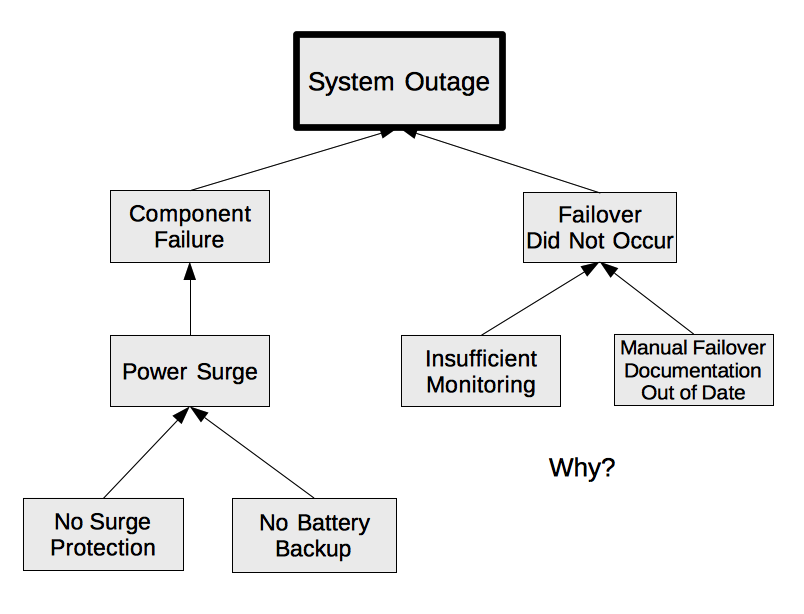

Written by Cody Wilbourn ([@codywilbourn](twitter.com/codywilbourn))

Edited by Kerim Satirli ([@ksatirli](twitter.com/ksatirli))

Post-mortems are an industry standard process that happens after incidents and outages as a method of continuous learning and improvement. While the exact format varies from company to company, your post-mortem report typically addresses the Five W’s:
* What happened?
* Where did it happen?
* Who was impacted by the incident?
* When did problem and resolution events occur?
* Why did the incident occur?

The first four questions are generally easy to answer. The question that takes the majority of the time is the **why**. To determine why the incident occurred requires investigative skills, critical thinking, and logical deductions. Sometimes determining the true *why* takes multiple incidents, as various fixes are attempted before the incident is resolved, but eventually a “root cause” is designated as the root of all the problems and the report is complete.

But if your “root cause” amounts to a *single* failure, you have stopped your process too soon.

## Root Cause is Plural
Like the word **data** is plural, the phrase “root cause” should be as well. There is never a singular *root cause*, but instead *root causes* that contribute to an incident. Furthering the plant metaphor, a root came from a seed, and in order to sprout, that seed needed sufficient nutrients, water, and sunlight. Failing to recognize those nutrients, water sources, and sunlight means you prematurely stopped your learning process. There are other roots growing in your field, maybe similar to the one remediated, maybe different, but feeding off of those same needs.

This isn’t just one root, there’s an entire system of roots.

## Digging into Why
Six Sigma suggests that you ask the question “[Why?](https://en.wikipedia.org/wiki/5_Whys)” five times, starting from the problem to determine the root cause. The investigative process you underwent already determined a root cause, but that singular cause is not enough.

Dig deeper. Start asking “Why?” from the root cause. This will unearth other reasons, most likely related to decisions and process that started the chain of events

### A Simple Component Failure
Probably one of the easiest apparent failures to diagnose are single component failures, such as a failed hard drive. The part fails, the server goes down, recovery processes follow and the post-mortem states the root cause was “Failed component. Remediated by replacing component.”

Do not stop there. Why did the component fail? What was it that contributed to the failure?

Did the component degrade over time, because it was in service for too long?

Did the component wear out because it was operated outside of its recommended specifications? That is to say, was it stressed by pressure, temperature, orientation, or other physical variables? Was it influenced by other nearby components, such as electromagnetic interference or chemical reactions?

Was the component operated within tolerances, but had a manufacturing defect?

Did the component have a design defect that rendered it incapable to run in the publicized specifications?

For each of those questions you can ask “Why?” again. For example, if the component was operated outside of the allowed tolerances:
* Why was it operated outside of specifications? 
* Why did the original decision making process select this component for the application?

What decisions and processes (or lack thereof) contributed to where things stand today?

This example corresponds to the [Space Shuttle Challenger explosion](https://en.wikipedia.org/wiki/Space_Shuttle_Challenger_disaster) in 1986.

Why did the Challenger explode? A single O-ring failed, causing a chain of events that ultimately led to the explosion.

Did people throw up their hands and say “this stuff happens when you shoot rockets into space?” No, they didn’t. They, through the Rogers Commission, dug deeper.

The O-ring failed due to material deformation caused by low temperatures, lower than what was projected in the engineering phase. That is to say, it was operated outside of specifications.

Despite the low temperature, the decision was made to launch. Okay, why? What information was provided for that decision, and how was it generated? Was all of the known information available? Why not? What processes around decision-making allowed that go/no-go decision?

Starting with just that initial root cause of an O-ring failure, the Rogers Commission was able to generate a [report](https://spaceflight.nasa.gov/outreach/SignificantIncidents/assets/rogers_commission_report.pdf) that resulted in [9 actions for improvement](https://history.nasa.gov/rogersrep/actions.pdf). 

If you stopped at “the part failed” and state that “things happen”, you missed out all of the learnings that could have happened.

Similarly, after the [Space Shuttle Columbia disaster](https://en.wikipedia.org/wiki/Space_Shuttle_Columbia_disaster), caused by a block of foam striking the left wing of the orbiter, the Columbia Accident Investigation Board was able to generate [a total of 29 recommendations for improvement](https://spaceflight.nasa.gov/shuttle/archives/sts-107/investigation/CAIB_medres_full.pdf).

What actions would your post-mortem process have resulted in? Ensure the foam doesn’t fall off? Improve the Orbiter so it can handle debris strikes without failure? Surely not all of the 29 recommendations would have been found.

### When To Stop Asking Why
The shuttle disasters were followed by reports that took months to generate after extensive investigation, due at least in part to the loss of life experienced with the disasters. So how much investigation is enough?

You stop asking why things happened when you reach a point where things are either completely outside your organization’s control or when it becomes cost prohibitive to address the risk. At some level, things become “acceptable risk” to the business. Sure you can manage a second CDN, or a second or third ISP to get to those last few nines of uptime, but then you realize if Amazon Web Service’s `us-east-1` region is down, half the Internet is down anyway.

But don’t let acceptable risk become a cop-out answer. If this outage was unplanned and people are panicked, then it was not an acceptable risk. One of the root causes would then lie in the process of determining what is acceptable. If the risk was truly acceptable you would be be writing an incident report and not doing a post-mortem analysis attempting to learn from the problems.

What is an acceptable risk event like? Several years ago I had this particular 5U server. This server appeared to have been dropped off a truck or conveyor belt by the delivery company, and arrived damaged with the frame bent. While the delivery insurance covered the cost of a replacement server (as the vendor refused to provide warranty coverage on the machine due to the extent of the housing damage and we could no longer use the machine for its original purpose), the machine still booted. So the IT team hammered the frame back in workable shape and the machine was put into service for another less critical use-case. It ran fine for two or three years, until one day it suddenly died. There was no panic, this was an inevitability always planned for. We said to ourselves “Well, today is the day that happened.” There was no post-mortem for the services on the machine. We migrated what had been on that machine and moved on.

That’s how you should react to an acceptable risk problem. “Today is the day that finally happened.” That’s not to say there’s not work to be done in a timely fashion after the problem occurred, but there’s no learnings or process improvements to be had. This event was expected from the very beginning.

## Mapping Causes and Effects
Complex investigations require investigating multiple avenues. Mapping the effects and causes in a tree visualization helps understanding of the problems cascade into each other, and may overlap. Visualizations can help promote collaboration -- mapping the causes and effects on a whiteboard or with Post-It notes is an easy activity for the post-mortem team to engage in. It’s easy to draw another line and add in more contributing factors as they’re identified. Mapping also ensures that all of the root causes are fully explored and nothing was missed accidentally.

The action items or other tasks required following up an incident will be to eliminate as many branches as possible, preferably the leaf nodes or one level up. Eliminating the root of the tree is the same as your current process -- it doesn’t ensure that these other contributing root causes won’t impact operations somewhere else in the future. Addressing as much of the problem surface as possible will maximize learnings and improvements, while minimizing the recurrence of issues.

As Margaret Hamilton, [Apollo scientist and United States Presidential Medal of Freedom recipient](https://en.wikipedia.org/wiki/Margaret_Hamilton_(scientist)) once said, “Learn from everyone and everything, including from that which you would least expect”. [source](https://www.safaribooksonline.com/library/view/site-reliability-engineering/9781491929117/preface01.html). Explore every avenue available to maximize the benefits of the post-mortem process.
